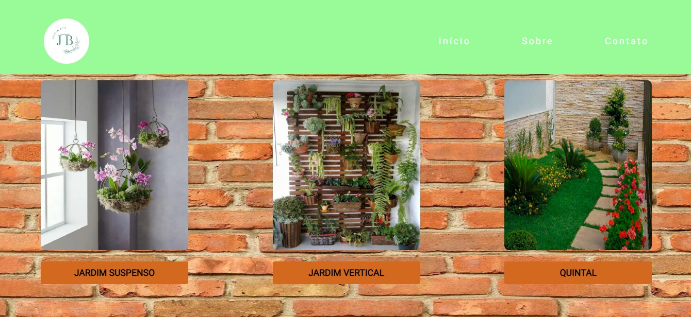

<h1 align="center"> Site de Dicas e vendas de Infoprodutos </h1>

  <a href="#-tecnologias">Tecnologias</a>&nbsp;&nbsp;&nbsp;|&nbsp;&nbsp;&nbsp;
  <a href="#-projeto">Projeto</a>&nbsp;&nbsp;&nbsp;|&nbsp;&nbsp;&nbsp;
  <a href="#-layout">Layout</a>&nbsp;&nbsp;&nbsp;|&nbsp;&nbsp;&nbsp;
  

 

   

## 🚀 Tecnologias

Esse projeto foi desenvolvido com as seguintes tecnologias:

- HTML  
- CSS
- JAVASCRIPT
- GIT  
- GITHUB

## 💻 Projeto

Esse projeto ele está  Responsivo para todos os dispositivos.

- [visite o projeto online] (https://jardimbom.netlify.app/)

   
